# Serialized output file sizes (2026)

Sizes are **bytes on disk** for serialized output (100k records), from `ls -l`.
## Results by format

### Java

|              | none       | gzip       | snappy     | lz4        | xz         | zstd       |
|--------------|------------|------------|------------|------------|------------|------------|
| mixedData    | 37,951,093 | 17,930,372 | 25,773,738 | 25,605,777 | 14,933,072 | 18,396,980 |
| onlyLongs    | 25,610,320 | 10,207,717 | 12,839,417 | 12,447,877 | 9,403,032  | 10,284,479 |
| onlyStrings  | 90,606,625 | 44,426,569 | 73,441,510 | 69,936,284 | 37,960,440 | 42,441,447 |

#### mixedData

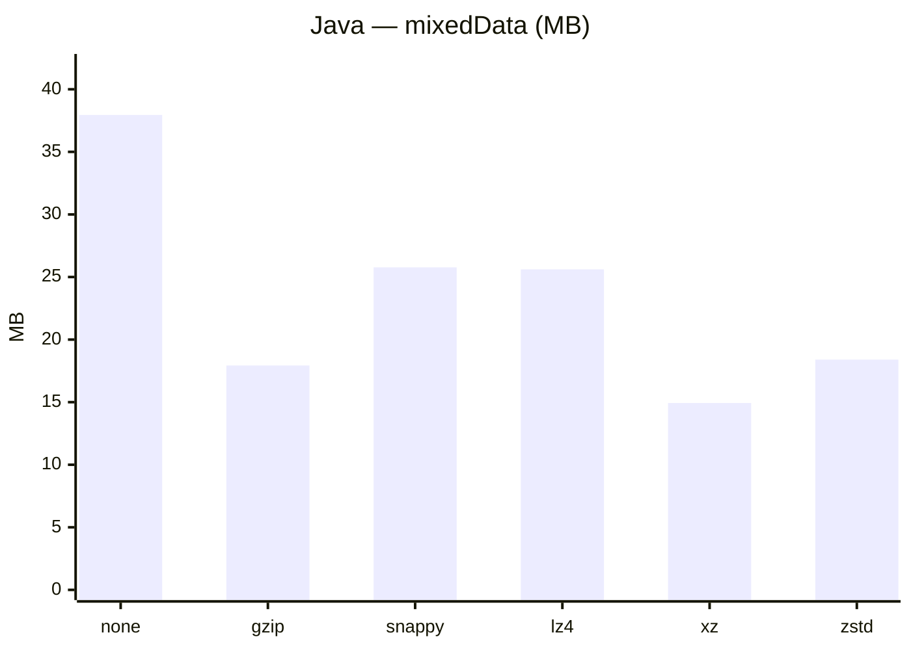
```mermaid
%%{init: {"config": {"xyChart": {"width": 610, "height": 360}}}}%%
xychart-beta
    title "Java — mixedData (MB)"
    x-axis ["none", "gzip", "snappy", "lz4", "xz", "zstd"]
    y-axis "MB" 0 --> 42
    bar [37.95, 17.93, 25.77, 25.61, 14.93, 18.4]
```

#### onlyLongs

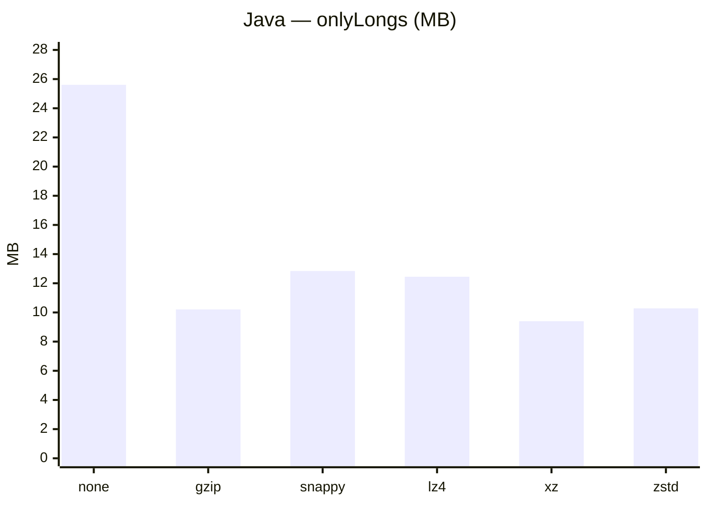
```mermaid
%%{init: {"config": {"xyChart": {"width": 610, "height": 360}}}}%%
xychart-beta
    title "Java — onlyLongs (MB)"
    x-axis ["none", "gzip", "snappy", "lz4", "xz", "zstd"]
    y-axis "MB" 0 --> 28
    bar [25.61, 10.21, 12.84, 12.45, 9.4, 10.28]
```

#### onlyStrings

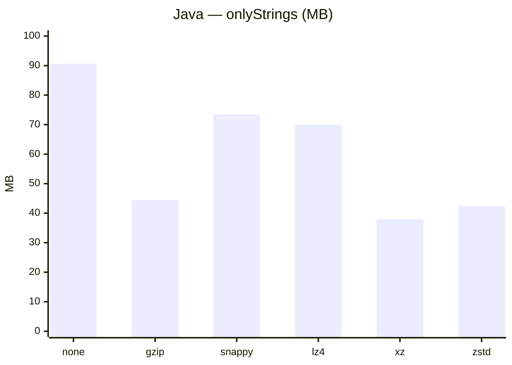
```mermaid
%%{init: {"config": {"xyChart": {"width": 610, "height": 360}}}}%%
xychart-beta
    title "Java — onlyStrings (MB)"
    x-axis ["none", "gzip", "snappy", "lz4", "xz", "zstd"]
    y-axis "MB" 0 --> 100
    bar [90.61, 44.43, 73.44, 69.94, 37.96, 42.44]
```

### Json

|             | none       | gzip       | snappy     | lz4        | xz         | zstd       |
|-------------|------------|------------|------------|------------|------------|------------|
| mixedData   | 54,364,018 | 22,472,516 | 52,396,341 | 36,181,902 | 18,685,252 | 30,199,221 |
| onlyLongs   | 38,173,122 | 13,959,884 | 36,099,183 | 23,733,303 | 12,915,648 | 20,390,026 |
| onlyStrings | 30,400,002 | 57,259,186 | 15,544,549 | 90,992,389 | 44,949,704 | 66,282,266 |

#### mixedData

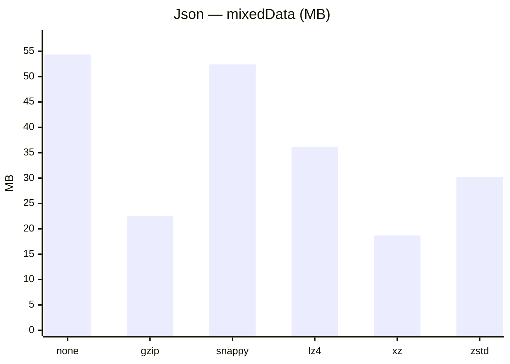
```mermaid
%%{init: {"config": {"xyChart": {"width": 610, "height": 360}}}}%%
xychart-beta
    title "Json — mixedData (MB)"
    x-axis ["none", "gzip", "snappy", "lz4", "xz", "zstd"]
    y-axis "MB" 0 --> 58
    bar [54.36, 22.47, 52.4, 36.18, 18.69, 30.2]
```

#### onlyLongs

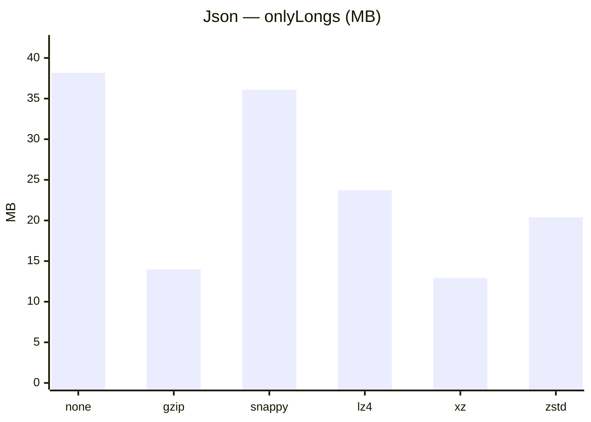
```mermaid
%%{init: {"config": {"xyChart": {"width": 610, "height": 360}}}}%%
xychart-beta
    title "Json — onlyLongs (MB)"
    x-axis ["none", "gzip", "snappy", "lz4", "xz", "zstd"]
    y-axis "MB" 0 --> 42
    bar [38.17, 13.96, 36.1, 23.73, 12.92, 20.39]
```

#### onlyStrings

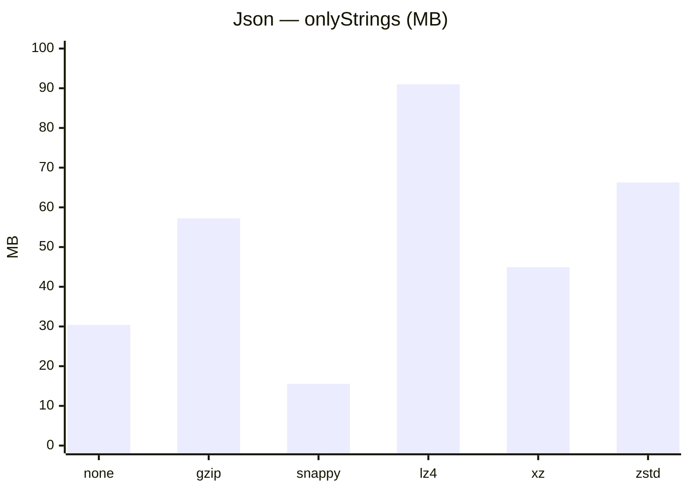
```mermaid
%%{init: {"config": {"xyChart": {"width": 610, "height": 360}}}}%%
xychart-beta
    title "Json — onlyStrings (MB)"
    x-axis ["none", "gzip", "snappy", "lz4", "xz", "zstd"]
    y-axis "MB" 0 --> 100
    bar [30.4, 57.26, 15.54, 90.99, 44.95, 66.28]
```

### Avro

|              | none       | deflate    | snappy     | xz         | bzip2      | zstd       |
|--------------|------------|------------|------------|------------|------------|------------|
| mixedData    | 22,723,794 | 16,694,512 | 22,370,461 | 15,005,240 | 14,728,978 | 16,588,948 |
| onlyLongs    | 11,602,655 | 9,823,440  | 11,398,717 | 9,299,892  | 9,447,654  | 9,855,216  |
| onlyStrings  | 76,127,354 | 43,457,387 | 75,005,139 | 37,599,808 | 38,821,030 | 40,686,773 |

#### mixedData

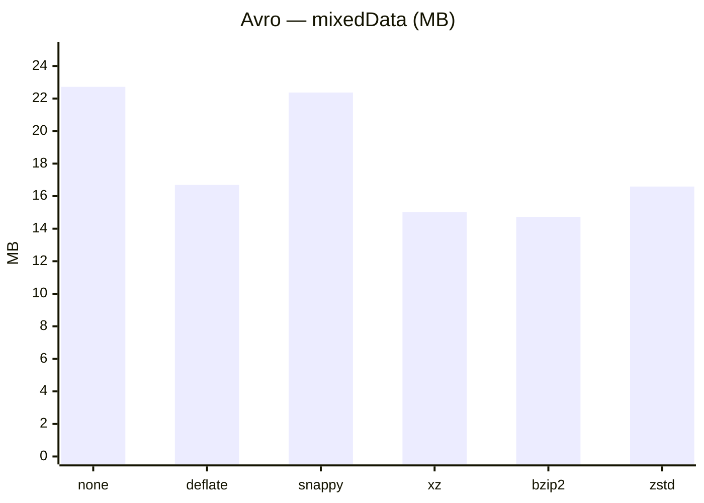
```mermaid
%%{init: {"config": {"xyChart": {"width": 610, "height": 360}}}}%%
xychart-beta
    title "Avro — mixedData (MB)"
    x-axis ["none", "deflate", "snappy", "xz", "bzip2", "zstd"]
    y-axis "MB" 0 --> 25
    bar [22.72, 16.69, 22.37, 15.01, 14.73, 16.59]
```

#### onlyLongs

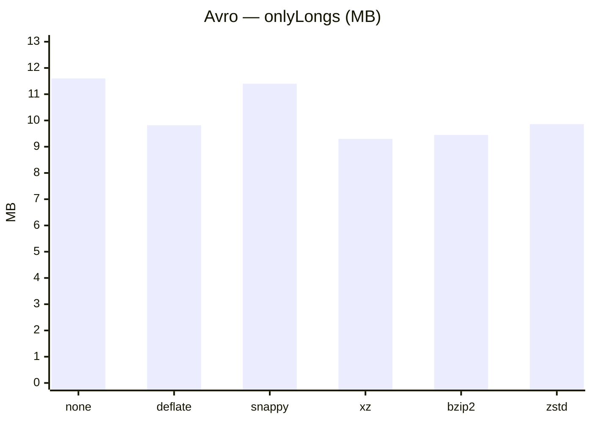
```mermaid
%%{init: {"config": {"xyChart": {"width": 610, "height": 360}}}}%%
xychart-beta
    title "Avro — onlyLongs (MB)"
    x-axis ["none", "deflate", "snappy", "xz", "bzip2", "zstd"]
    y-axis "MB" 0 --> 13
    bar [11.6, 9.82, 11.4, 9.3, 9.45, 9.86]
```

#### onlyStrings

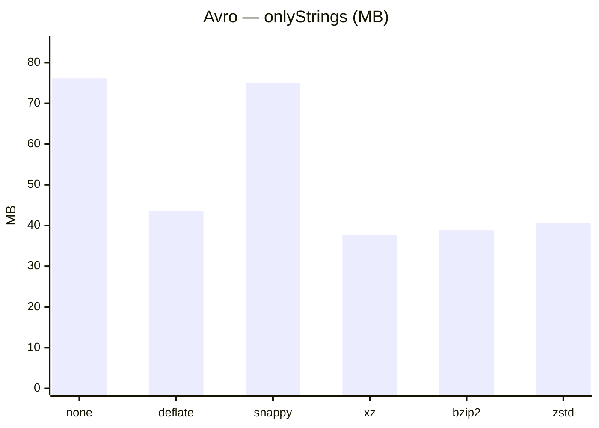
```mermaid
%%{init: {"config": {"xyChart": {"width": 610, "height": 360}}}}%%
xychart-beta
    title "Avro — onlyStrings (MB)"
    x-axis ["none", "deflate", "snappy", "xz", "bzip2", "zstd"]
    y-axis "MB" 0 --> 85
    bar [76.13, 43.46, 75.01, 37.6, 38.82, 40.69]
```

### Thrift (binary protocol)

|              | none        | gzip       | snappy     | lz4        | xz         | zstd       |
|--------------|-------------|------------|------------|------------|------------|------------|
| mixedData    | 38,673,152  | 17,677,927 | 23,759,227 | 22,880,908 | 14,869,400 | 17,514,774 |
| onlyLongs    | 16,307,456  | 10,196,439 | 11,585,112 | 11,517,779 | 8,933,784  | 10,391,607 |
| onlyStrings  | 102,800,000 | 46,339,274 | 77,798,386 | 72,930,488 | 38,288,884 | 43,905,360 |

#### mixedData

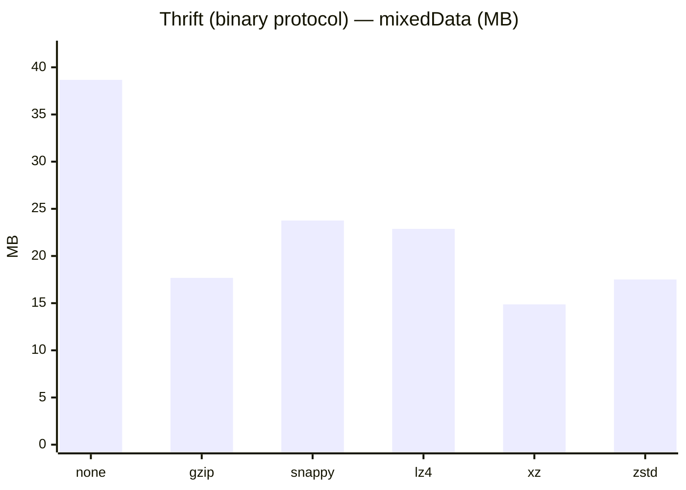
```mermaid
%%{init: {"config": {"xyChart": {"width": 610, "height": 360}}}}%%
xychart-beta
    title "Thrift (binary protocol) — mixedData (MB)"
    x-axis ["none", "gzip", "snappy", "lz4", "xz", "zstd"]
    y-axis "MB" 0 --> 42
    bar [38.67, 17.68, 23.76, 22.88, 14.87, 17.51]
```

#### onlyLongs

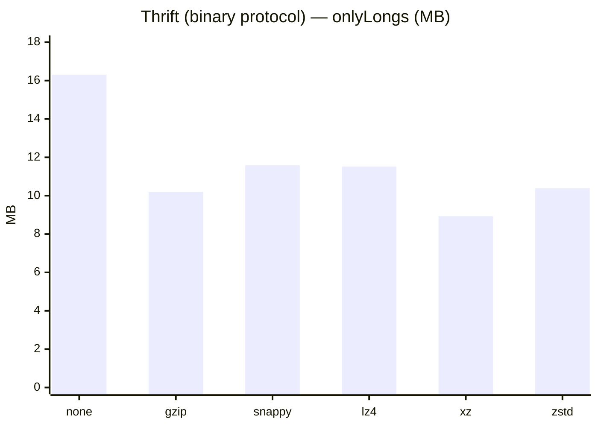
```mermaid
%%{init: {"config": {"xyChart": {"width": 610, "height": 360}}}}%%
xychart-beta
    title "Thrift (binary protocol) — onlyLongs (MB)"
    x-axis ["none", "gzip", "snappy", "lz4", "xz", "zstd"]
    y-axis "MB" 0 --> 18
    bar [16.31, 10.2, 11.59, 11.52, 8.93, 10.39]
```

#### onlyStrings

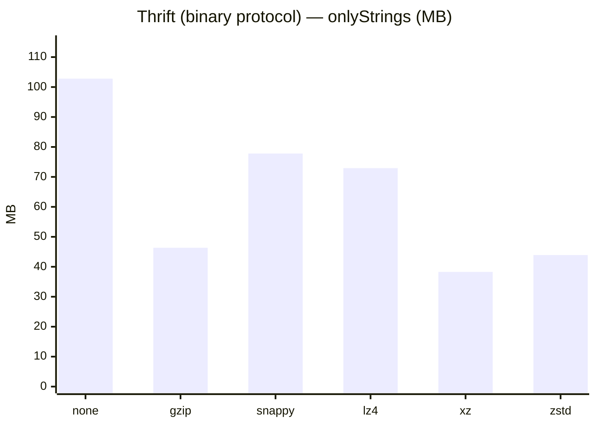
```mermaid
%%{init: {"config": {"xyChart": {"width": 610, "height": 360}}}}%%
xychart-beta
    title "Thrift (binary protocol) — onlyStrings (MB)"
    x-axis ["none", "gzip", "snappy", "lz4", "xz", "zstd"]
    y-axis "MB" 0 --> 115
    bar [102.8, 46.34, 77.8, 72.93, 38.29, 43.91]
```

### Thrift (compact protocol)

|              | none        | gzip       | snappy     | lz4        | xz         | zstd       |
|--------------|-------------|------------|------------|------------|------------|------------|
| mixedData    | 32,519,040  | 17,356,376 | 22,782,492 | 22,070,581 | 14,805,864 | 17,185,943 |
| onlyLongs    | 14,909,184  | 9,900,293  | 11,341,566 | 11,213,188 | 9,303,548  | 9,844,996  |
| onlyStrings  | 102,800,000 | 44,132,682 | 75,268,129 | 69,349,947 | 37,160,328 | 41,410,399 |

#### mixedData

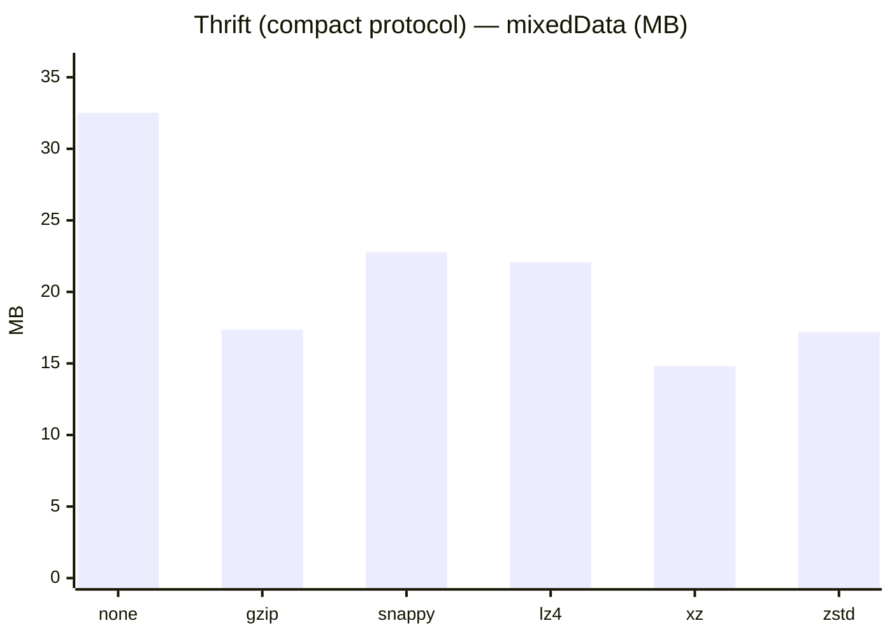
```mermaid
%%{init: {"config": {"xyChart": {"width": 610, "height": 360}}}}%%
xychart-beta
    title "Thrift (compact protocol) — mixedData (MB)"
    x-axis ["none", "gzip", "snappy", "lz4", "xz", "zstd"]
    y-axis "MB" 0 --> 36
    bar [32.52, 17.36, 22.78, 22.07, 14.81, 17.19]
```

#### onlyLongs

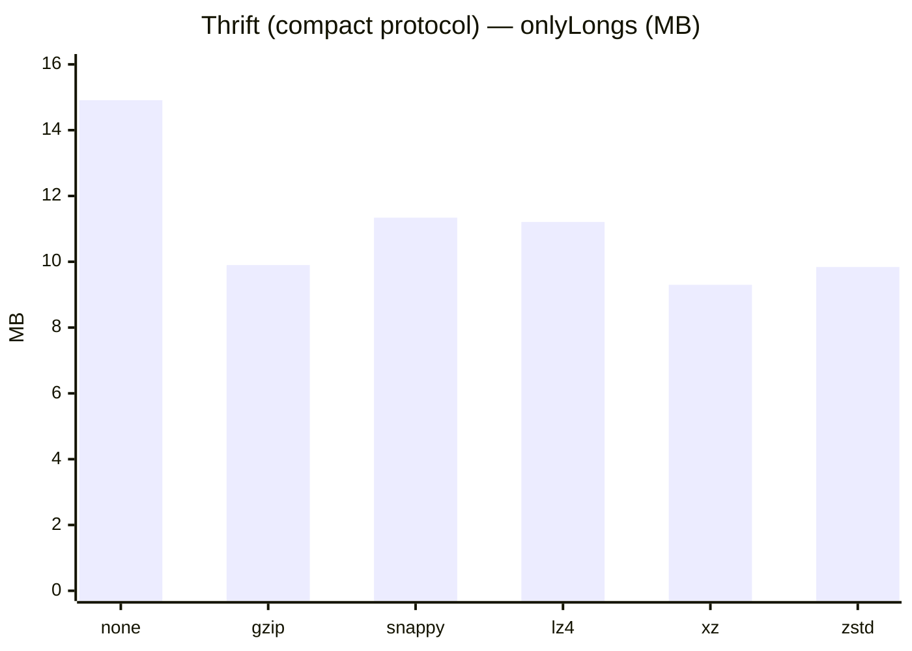
```mermaid
%%{init: {"config": {"xyChart": {"width": 610, "height": 360}}}}%%
xychart-beta
    title "Thrift (compact protocol) — onlyLongs (MB)"
    x-axis ["none", "gzip", "snappy", "lz4", "xz", "zstd"]
    y-axis "MB" 0 --> 16
    bar [14.91, 9.9, 11.34, 11.21, 9.3, 9.84]
```

#### onlyStrings

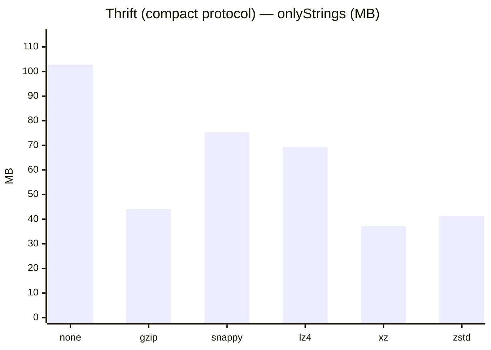
```mermaid
%%{init: {"config": {"xyChart": {"width": 610, "height": 360}}}}%%
xychart-beta
    title "Thrift (compact protocol) — onlyStrings (MB)"
    x-axis ["none", "gzip", "snappy", "lz4", "xz", "zstd"]
    y-axis "MB" 0 --> 115
    bar [102.8, 44.13, 75.27, 69.35, 37.16, 41.41]
```

### Protobuf

|              | none       | gzip       | snappy     | lz4        | xz         | zstd       |
|--------------|------------|------------|------------|------------|------------|------------|
| mixedData    | 22,913,304 | 16,985,043 | 22,874,142 | 21,904,990 | 14,656,644 | 16,970,441 |
| onlyLongs    | 11,145,897 | 10,064,294 | 11,149,808 | 11,141,548 | 9,629,540  | 10,051,934 |
| onlyStrings  | 76,900,000 | 44,451,702 | 76,567,456 | 71,012,666 | 37,794,744 | 42,349,701 |

#### mixedData

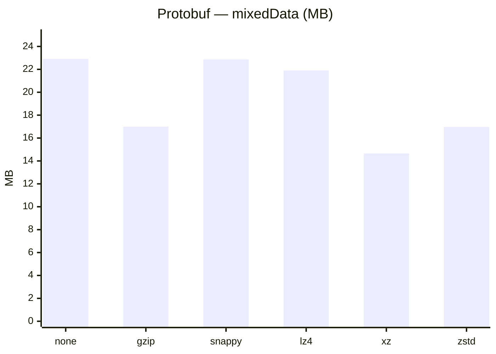
```mermaid
%%{init: {"config": {"xyChart": {"width": 610, "height": 360}}}}%%
xychart-beta
    title "Protobuf — mixedData (MB)"
    x-axis ["none", "gzip", "snappy", "lz4", "xz", "zstd"]
    y-axis "MB" 0 --> 25
    bar [22.91, 16.99, 22.87, 21.9, 14.66, 16.97]
```

#### onlyLongs

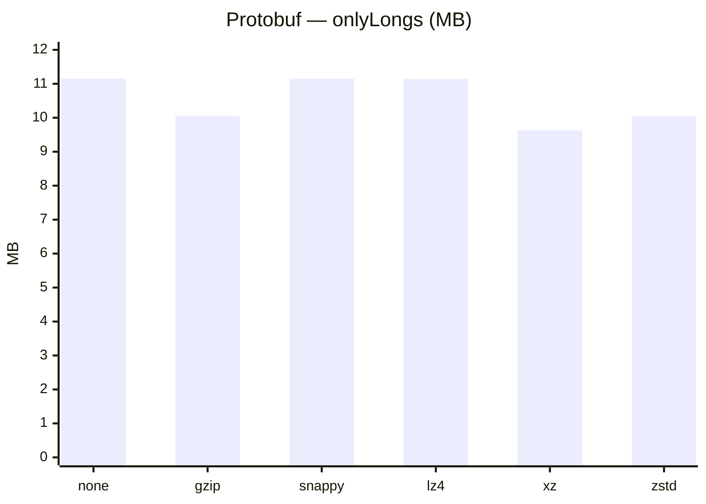
```mermaid
%%{init: {"config": {"xyChart": {"width": 610, "height": 360}}}}%%
xychart-beta
    title "Protobuf — onlyLongs (MB)"
    x-axis ["none", "gzip", "snappy", "lz4", "xz", "zstd"]
    y-axis "MB" 0 --> 12
    bar [11.15, 10.06, 11.15, 11.14, 9.63, 10.05]
```

#### onlyStrings

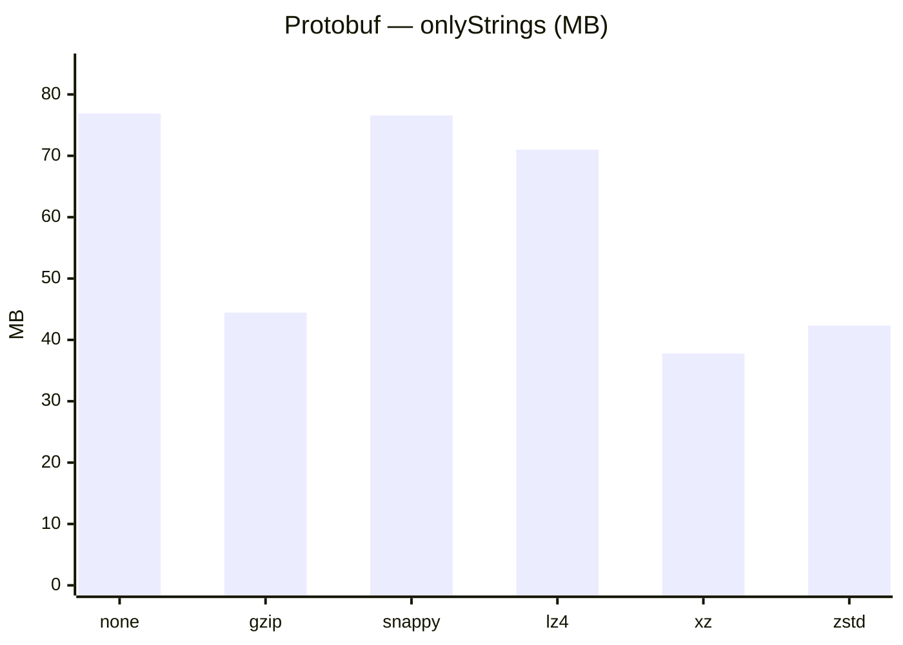
```mermaid
%%{init: {"config": {"xyChart": {"width": 610, "height": 360}}}}%%
xychart-beta
    title "Protobuf — onlyStrings (MB)"
    x-axis ["none", "gzip", "snappy", "lz4", "xz", "zstd"]
    y-axis "MB" 0 --> 85
    bar [76.9, 44.45, 76.57, 71.01, 37.79, 42.35]
```

### ORC

|              | none       | snappy     | zlib       | lz0        | lz4        | zstd       | brotli     |
|--------------|------------|------------|------------|------------|------------|------------|------------|
| mixedData    | 22,231,827 | 20,573,373 | 14,799,829 | 21,534,931 | 21,486,356 | 14,509,311 | 13,809,149 |
| onlyLongs    | 12,514,162 | 9,705,197  | 9,259,784  | 10,004,456 | 9,967,321  | 9,045,890  | 9,375,716  |
| onlyStrings  | 72,044,901 | 68,512,618 | 42,072,546 | 72,025,871 | 71,905,093 | 40,952,617 | 36,939,624 |

#### mixedData

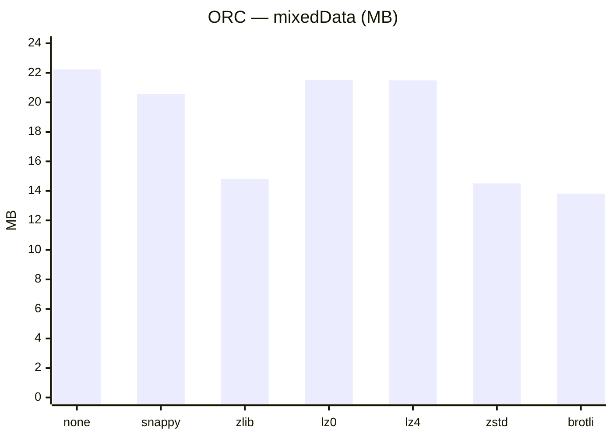
```mermaid
%%{init: {"config": {"xyChart": {"width": 695, "height": 360}}}}%%
xychart-beta
    title "ORC — mixedData (MB)"
    x-axis ["none", "snappy", "zlib", "lz0", "lz4", "zstd", "brotli"]
    y-axis "MB" 0 --> 24
    bar [22.23, 20.57, 14.8, 21.53, 21.49, 14.51, 13.81]
```

#### onlyLongs

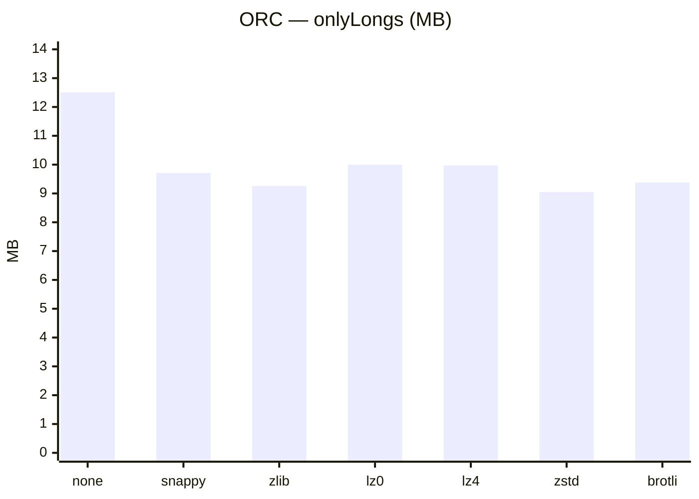
```mermaid
%%{init: {"config": {"xyChart": {"width": 695, "height": 360}}}}%%
xychart-beta
    title "ORC — onlyLongs (MB)"
    x-axis ["none", "snappy", "zlib", "lz0", "lz4", "zstd", "brotli"]
    y-axis "MB" 0 --> 14
    bar [12.51, 9.71, 9.26, 10.0, 9.97, 9.05, 9.38]
```

#### onlyStrings

```mermaid
%%{init: {"config": {"xyChart": {"width": 695, "height": 360}}}}%%
xychart-beta
    title "ORC — onlyStrings (MB)"
    x-axis ["none", "snappy", "zlib", "lz0", "lz4", "zstd", "brotli"]
    y-axis "MB" 0 --> 80
    bar [72.04, 68.51, 42.07, 72.03, 71.91, 40.95, 36.94]
```

### Parquet (parquet-avro)

|              | none       | snappy     | gzip       | lz4        | zstd       |
|--------------|------------|------------|------------|------------|------------|
| mixedData    | 21,595,786 | 20,103,928 | 14,143,560 | 20,845,124 | 13,659,354 |
| onlyLongs    | 8,267,072  | 8,247,028  | 8,223,377  | 8,270,791  | 8,268,275  |
| onlyStrings  | 80,018,707 | 72,219,127 | 43,747,037 | 76,164,430 | 41,104,998 |

#### mixedData

```mermaid
%%{init: {"config": {"xyChart": {"width": 525, "height": 360}}}}%%
xychart-beta
    title "Parquet (parquet-avro) — mixedData (MB)"
    x-axis ["none", "snappy", "gzip", "lz4", "zstd"]
    y-axis "MB" 0 --> 24
    bar [21.6, 20.1, 14.14, 20.85, 13.66]
```

#### onlyLongs

```mermaid
%%{init: {"config": {"xyChart": {"width": 525, "height": 360}}}}%%
xychart-beta
    title "Parquet (parquet-avro) — onlyLongs (MB)"
    x-axis ["none", "snappy", "gzip", "lz4", "zstd"]
    y-axis "MB" 0 --> 9
    bar [8.27, 8.25, 8.22, 8.27, 8.27]
```

#### onlyStrings

```mermaid
%%{init: {"config": {"xyChart": {"width": 525, "height": 360}}}}%%
xychart-beta
    title "Parquet (parquet-avro) — onlyStrings (MB)"
    x-axis ["none", "snappy", "gzip", "lz4", "zstd"]
    y-axis "MB" 0 --> 87
    bar [80.02, 72.22, 43.75, 76.16, 41.1]
```

### Parquet (parquet-thrift)

|              | none       | snappy     | gzip       | lz4        | zstd       |
|--------------|------------|------------|------------|------------|------------|
| mixedData    | 23,483,233 | 21,502,596 | 15,085,304 | 22,265,594 | 14,674,280 |
| onlyLongs    | 11,813,874 | 11,168,920 | 10,358,921 | 11,278,716 | 10,531,601 |
| onlyStrings  | 80,021,698 | 72,222,118 | 43,750,028 | 76,167,421 | 41,107,989 |

#### mixedData

```mermaid
%%{init: {"config": {"xyChart": {"width": 525, "height": 360}}}}%%
xychart-beta
    title "Parquet (parquet-thrift) — mixedData (MB)"
    x-axis ["none", "snappy", "gzip", "lz4", "zstd"]
    y-axis "MB" 0 --> 26
    bar [23.48, 21.5, 15.09, 22.27, 14.67]
```

#### onlyLongs

```mermaid
%%{init: {"config": {"xyChart": {"width": 525, "height": 360}}}}%%
xychart-beta
    title "Parquet (parquet-thrift) — onlyLongs (MB)"
    x-axis ["none", "snappy", "gzip", "lz4", "zstd"]
    y-axis "MB" 0 --> 13
    bar [11.81, 11.17, 10.36, 11.28, 10.53]
```

#### onlyStrings

```mermaid
%%{init: {"config": {"xyChart": {"width": 525, "height": 360}}}}%%
xychart-beta
    title "Parquet (parquet-thrift) — onlyStrings (MB)"
    x-axis ["none", "snappy", "gzip", "lz4", "zstd"]
    y-axis "MB" 0 --> 87
    bar [80.02, 72.22, 43.75, 76.17, 41.11]
```

### Msgpack

|              | none       | gzip       | snappy     | lz4        | xz         | zstd       |
|--------------|------------|------------|------------|------------|------------|------------|
| mixedData    | 22,312,244 | 16,380,733 | 22,337,073 | 21,331,339 | 14,641,100 | 16,645,717 |
| onlyLongs    | 10,105,770 | 9,407,456  | 10,106,959 | 10,032,253 | 9,300,864  | 9,420,601  |
| onlyStrings  | 76,300,000 | 42,940,659 | 76,324,268 | 68,733,101 | 37,335,128 | 41,433,054 |

#### mixedData

```mermaid
%%{init: {"config": {"xyChart": {"width": 610, "height": 360}}}}%%
xychart-beta
    title "Msgpack — mixedData (MB)"
    x-axis ["none", "gzip", "snappy", "lz4", "xz", "zstd"]
    y-axis "MB" 0 --> 24
    bar [22.31, 16.38, 22.34, 21.33, 14.64, 16.65]
```

#### onlyLongs

```mermaid
%%{init: {"config": {"xyChart": {"width": 610, "height": 360}}}}%%
xychart-beta
    title "Msgpack — onlyLongs (MB)"
    x-axis ["none", "gzip", "snappy", "lz4", "xz", "zstd"]
    y-axis "MB" 0 --> 11
    bar [10.11, 9.41, 10.11, 10.03, 9.3, 9.42]
```

#### onlyStrings

```mermaid
%%{init: {"config": {"xyChart": {"width": 610, "height": 360}}}}%%
xychart-beta
    title "Msgpack — onlyStrings (MB)"
    x-axis ["none", "gzip", "snappy", "lz4", "xz", "zstd"]
    y-axis "MB" 0 --> 83
    bar [76.3, 42.94, 76.32, 68.73, 37.34, 41.43]
```

### CBOR
|              | none       | gzip       | snappy     | lz4        | xz         | zstd       |
|--------------|------------|------------|------------|------------|------------|------------|
| mixedData    | 22,489,054 | 16,421,929 | 22,459,267 | 21,404,592 | 14,714,196 | 16,506,853 |
| onlyLongs    | 10,400,072 | 9,498,079  | 10,271,873 | 10,244,659 | 9,121,880  | 9,436,745  |
| onlyStrings  | 76,400,000 | 42,966,763 | 75,562,031 | 68,721,503 | 37,280,848 | 40,915,945 |

#### mixedData

```mermaid
%%{init: {"config": {"xyChart": {"width": 610, "height": 360}}}}%%
xychart-beta
    title "CBOR — mixedData (MB)"
    x-axis ["none", "gzip", "snappy", "lz4", "xz", "zstd"]
    y-axis "MB" 0 --> 25
    bar [22.49, 16.42, 22.46, 21.4, 14.71, 16.51]
```

#### onlyLongs

```mermaid
%%{init: {"config": {"xyChart": {"width": 610, "height": 360}}}}%%
xychart-beta
    title "CBOR — onlyLongs (MB)"
    x-axis ["none", "gzip", "snappy", "lz4", "xz", "zstd"]
    y-axis "MB" 0 --> 11
    bar [10.4, 9.5, 10.27, 10.24, 9.12, 9.44]
```

#### onlyStrings

```mermaid
%%{init: {"config": {"xyChart": {"width": 610, "height": 360}}}}%%
xychart-beta
    title "CBOR — onlyStrings (MB)"
    x-axis ["none", "gzip", "snappy", "lz4", "xz", "zstd"]
    y-axis "MB" 0 --> 83
    bar [76.4, 42.97, 75.56, 68.72, 37.28, 40.92]
```

