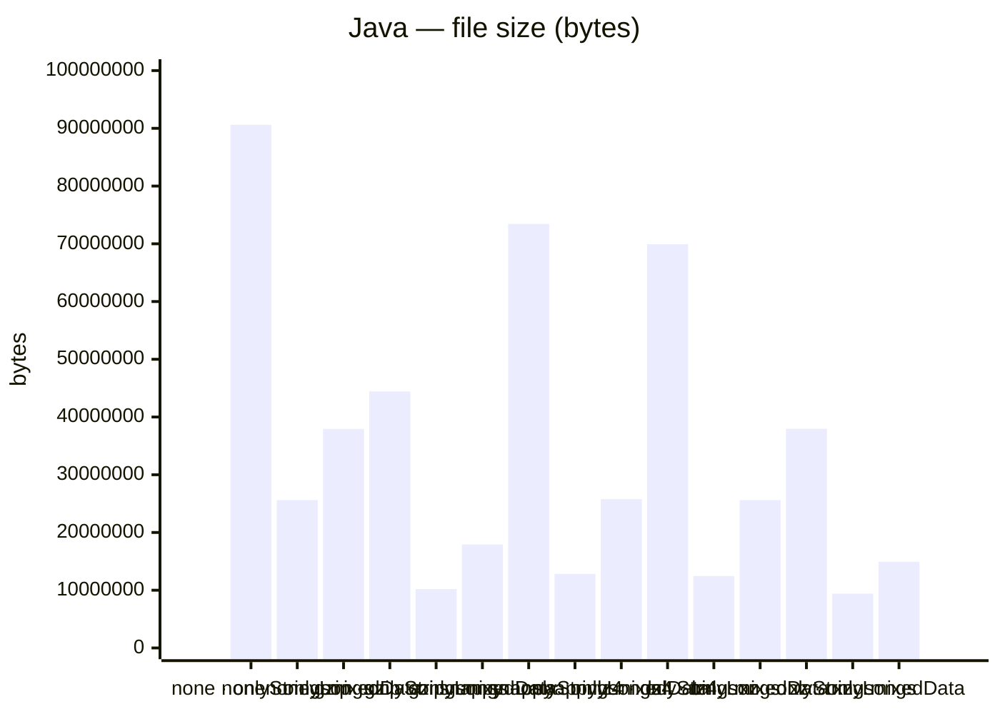
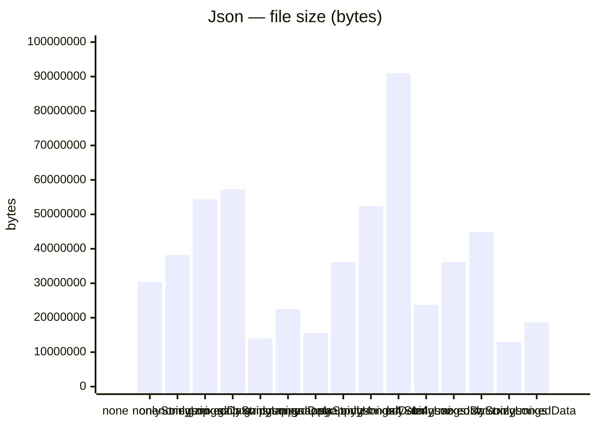
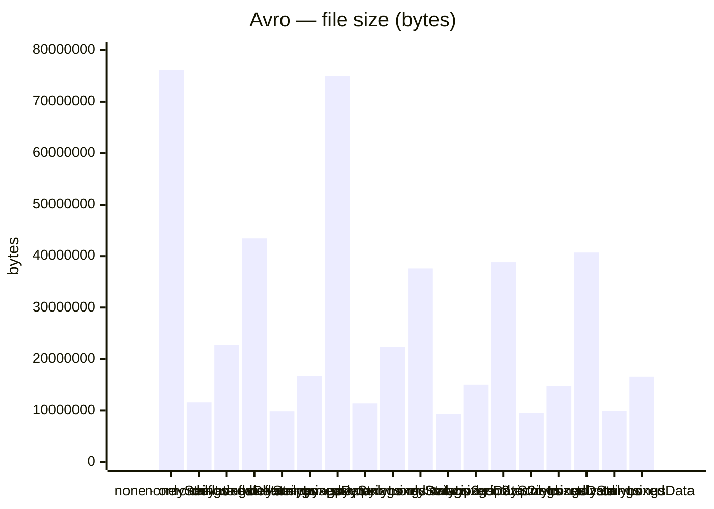
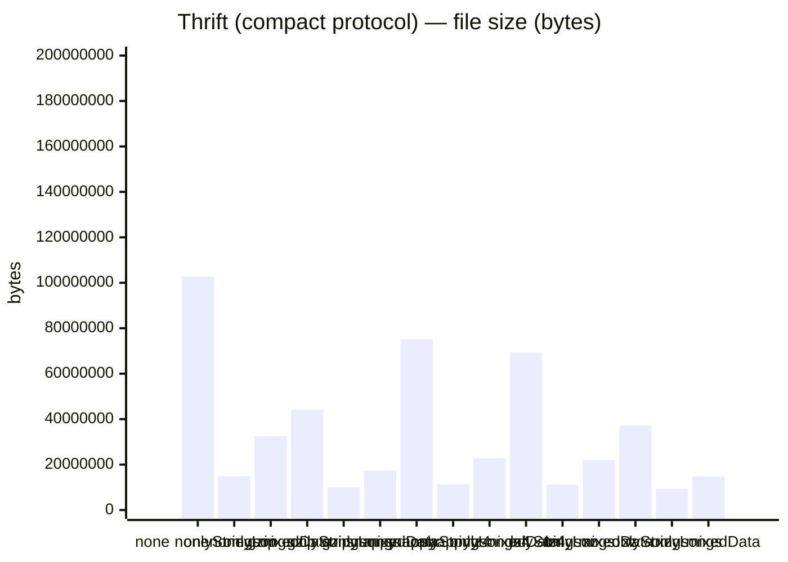
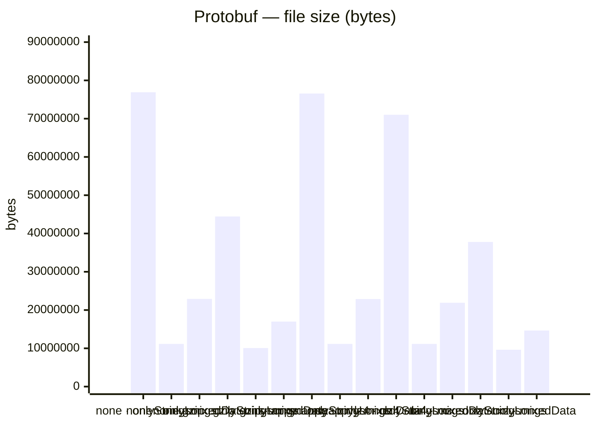
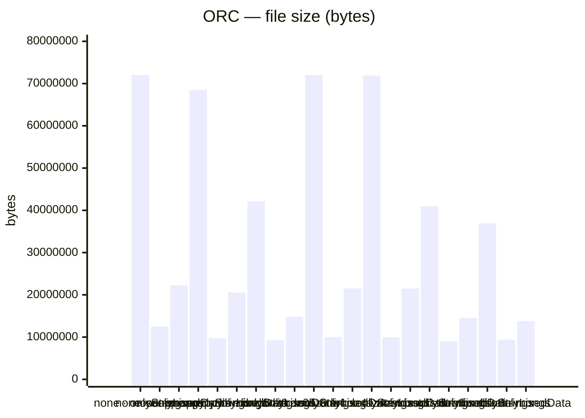
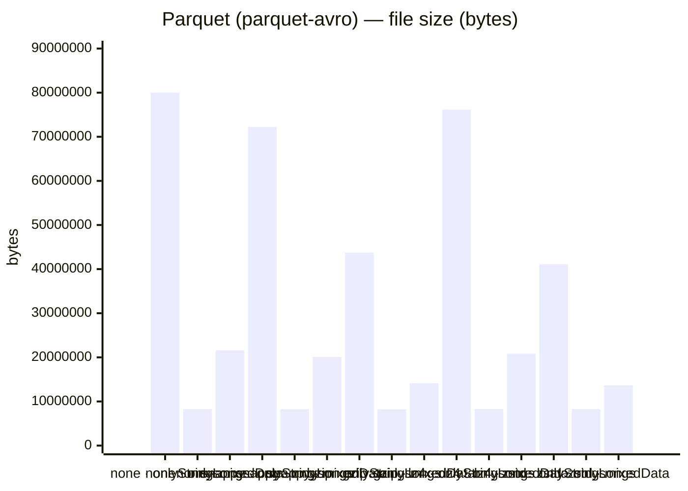
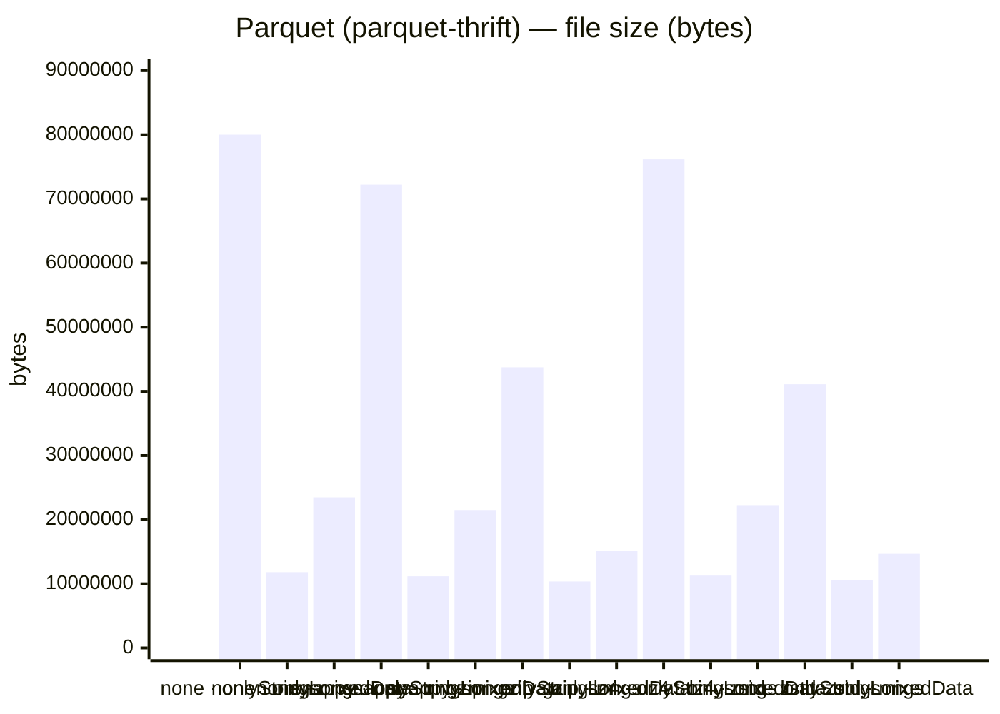
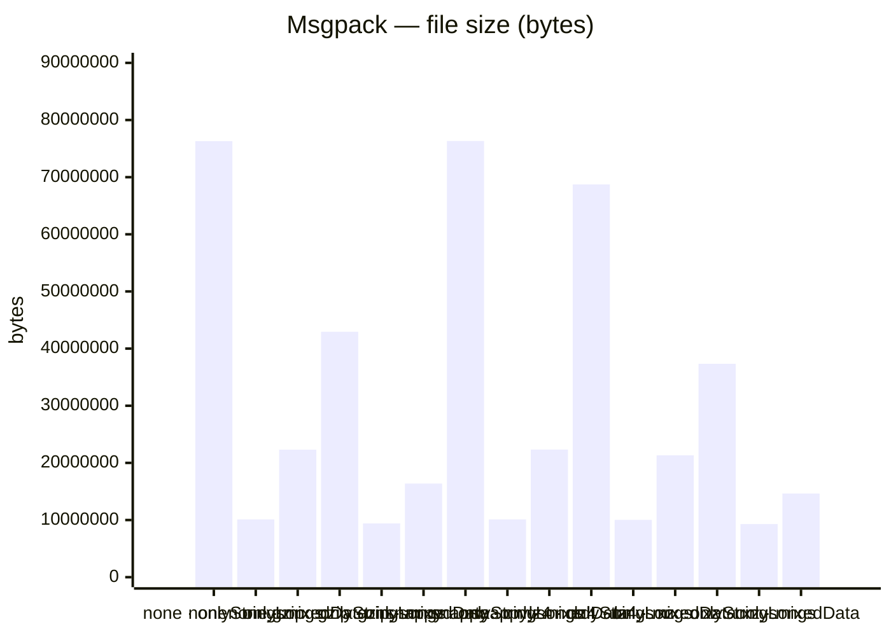
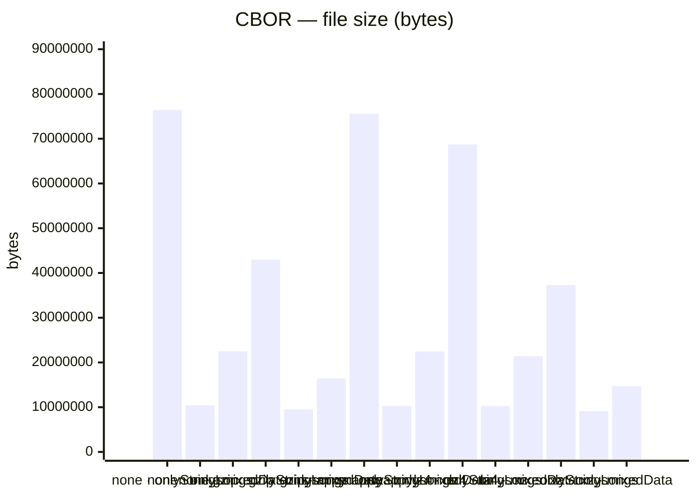

# Serialized output file sizes (2026)

Sizes are **bytes on disk** for serialized output (100k records), from `ls -l`.
## Results by format

### Java

|              | none       | gzip       | snappy     | lz4        | xz         |
|--------------|------------|------------|------------|------------|------------|
| mixedData    | 37,951,093 | 17,930,372 | 25,773,738 | 25,605,777 | 14,933,072 |
| onlyLongs    | 25,610,320 | 10,207,717 | 12,839,417 | 12,447,877 | 9,403,032  |
| onlyStrings  | 90,606,625 | 44,426,569 | 73,441,510 | 69,936,284 | 37,960,440 |

### Json

|              | none       | gzip       | snappy     | lz4        | xz         |
|--------------|------------|------------|------------|------------|------------|
| mixedData    | 54,364,018 | 22,472,516 | 52,396,341 | 36,181,902 | 18,685,252 |
| onlyLongs    | 38,173,122 | 13,959,884 | 36,099,183 | 23,733,303 | 12,915,648 |
| onlyStrings  | 30,400,002 | 57,259,186 | 15,544,549 | 90,992,389 | 44,949,704 |

### Avro

|              | none       | deflate    | snappy     | xz         | bzip2      | zstd       |
|--------------|------------|------------|------------|------------|------------|------------|
| mixedData    | 22,723,794 | 16,694,512 | 22,370,461 | 15,005,240 | 14,728,978 | 16,588,948 |
| onlyLongs    | 11,602,655 | 9,823,440  | 11,398,717 | 9,299,892  | 9,447,654  | 9,855,216  |
| onlyStrings  | 76,127,354 | 43,457,387 | 75,005,139 | 37,599,808 | 38,821,030 | 40,686,773 |

### Thrift (binary protocol)

|              | none        | gzip       | snappy     | lz4        | xz         |
|--------------|-------------|------------|------------|------------|------------|
| mixedData    | 38,673,152  | 17,677,927 | 23,759,227 | 22,880,908 | 14,869,400 |
| onlyLongs    | 16,307,456  | 10,196,439 | 11,585,112 | 11,517,779 | 8,933,784  |
| onlyStrings  | 102,800,000 | 46,339,274 | 77,798,386 | 72,930,488 | 38,288,884 |

### Thrift (compact protocol)

|              | none        | gzip       | snappy     | lz4        | xz         |
|--------------|-------------|------------|------------|------------|------------|
| mixedData    | 32,519,040  | 17,356,376 | 22,782,492 | 22,070,581 | 14,805,864 |
| onlyLongs    | 14,909,184  | 9,900,293  | 11,341,566 | 11,213,188 | 9,303,548  |
| onlyStrings  | 102,800,000 | 44,132,682 | 75,268,129 | 69,349,947 | 37,160,328 |

### Protobuf

|              | none       | gzip       | snappy     | lz4        | xz         |
|--------------|------------|------------|------------|------------|------------|
| mixedData    | 22,913,304 | 16,985,043 | 22,874,142 | 21,904,990 | 14,656,644 |
| onlyLongs    | 11,145,897 | 10,064,294 | 11,149,808 | 11,141,548 | 9,629,540  |
| onlyStrings  | 76,900,000 | 44,451,702 | 76,567,456 | 71,012,666 | 37,794,744 |

### ORC

|              | none       | snappy     | zlib       | lz0        | lz4        | zstd       | brotli     |
|--------------|------------|------------|------------|------------|------------|------------|------------|
| mixedData    | 22,231,827 | 20,573,373 | 14,799,829 | 21,534,931 | 21,486,356 | 14,509,311 | 13,809,149 |
| onlyLongs    | 12,514,162 | 9,705,197  | 9,259,784  | 10,004,456 | 9,967,321  | 9,045,890  | 9,375,716  |
| onlyStrings  | 72,044,901 | 68,512,618 | 42,072,546 | 72,025,871 | 71,905,093 | 40,952,617 | 36,939,624 |

### Parquet (parquet-avro)

|              | none       | snappy     | gzip       | lz4        | zstd       |
|--------------|------------|------------|------------|------------|------------|
| mixedData    | 21,595,786 | 20,103,928 | 14,143,560 | 20,845,124 | 13,659,354 |
| onlyLongs    | 8,267,072  | 8,247,028  | 8,223,377  | 8,270,791  | 8,268,275  |
| onlyStrings  | 80,018,707 | 72,219,127 | 43,747,037 | 76,164,430 | 41,104,998 |

### Parquet (parquet-thrift)

|              | none       | snappy     | gzip       | lz4        | zstd       |
|--------------|------------|------------|------------|------------|------------|
| mixedData    | 23,483,233 | 21,502,596 | 15,085,304 | 22,265,594 | 14,674,280 |
| onlyLongs    | 11,813,874 | 11,168,920 | 10,358,921 | 11,278,716 | 10,531,601 |
| onlyStrings  | 80,021,698 | 72,222,118 | 43,750,028 | 76,167,421 | 41,107,989 |

### Msgpack

|              | none       | gzip       | snappy     | lz4        | xz         |
|--------------|------------|------------|------------|------------|------------|
| mixedData    | 22,312,244 | 16,380,733 | 22,337,073 | 21,331,339 | 14,641,100 |
| onlyLongs    | 10,105,770 | 9,407,456  | 10,106,959 | 10,032,253 | 9,300,864  |
| onlyStrings  | 76,300,000 | 42,940,659 | 76,324,268 | 68,733,101 | 37,335,128 |

### CBOR

|              | none       | gzip       | snappy     | lz4        | xz         |
|--------------|------------|------------|------------|------------|------------|
| mixedData    | 22,489,054 | 16,421,929 | 22,459,267 | 21,404,592 | 14,714,196 |
| onlyLongs    | 10,400,072 | 9,498,079  | 10,271,873 | 10,244,659 | 9,121,880  |
| onlyStrings  | 76,400,000 | 42,966,763 | 75,562,031 | 68,721,503 | 37,280,848 |

